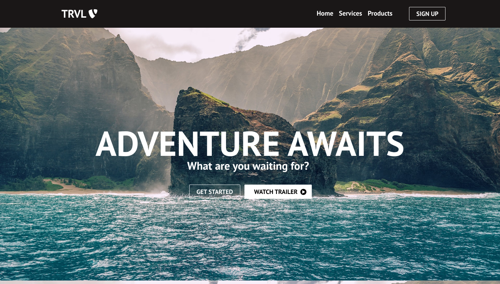

<h1 align="center">
  
</h1>

<p align="center">
    
</p>

<br>

## 💻 Project

TRVL is an idea of a beautiful and responsive travel website design.

## 🧪 Development

This project was developed using [React](https://reactjs.org).

## 🚀 Running

To start the project, execute the following commands:
```bash
# To install all dependencies
$ yarn

# To start the project
$ yarn start
```
The app will be available on the browser by accessing the address http://localhost:3000.